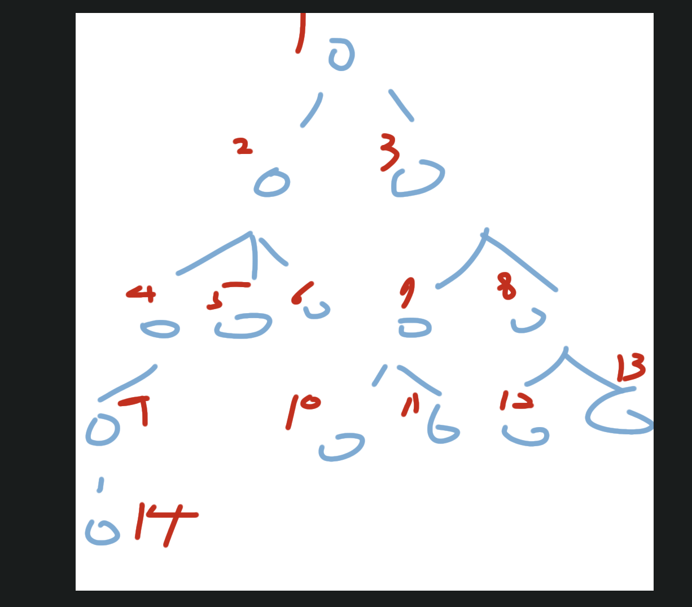

# 탐색 알고리즘 복습

### 0. State space tree

---

- 탐색문제를 해결하는 과정에서, 이 문제해결과정을 트리로 모델링하는 것.
- 각 노드는 상태를 가진다
- 각 브랜치는 노드가 변경될 수 있는 명령의 경우의 수다.
    - 예를 들어 동서남북으로 움직이는 로봇이 있다면, 브랜치는 동, 서, 남, 북이 될 수 있다.
- 상태공간트리를 모델링하는 연습을 다시 해야한다

  

### 1. Depth First Search(DFS)

---

- 깊이우선탐색. 여기서 말하는 깊이란 무엇인가 하니,
    
    
    
- 트리의 깊이를 말한다
- 즉 상태공간트리를 탐색할 때, 어떤 노드를 탐색한다면 그것의 자식노드를 모두 탐색한 뒤에야 부모노드로 돌아오는 것을 말한다
- 자료구조 스택을 활용하면 된다
    - 일반적으로 함수는 스레드에서 콜스택이라고 하는 부분에 저장되는데, 콜스택은 스택이므로 재귀함수를 사용한다면 DFS를 구현할 수 있다.
    - 아니면 자료구조 stack을 구현해서 사용해도 된다
- 흔히 발생하는 문제는 어떤 노드의 상태가 다른 탐색에서도 발견되는 경우이다. 즉 중복된 상태가 빈번히 일어나면 탐색의 효율이 떨어지므로 적당한 가지치기가 필요하다.

  

### 2. Breadth First Search(BFS)

---

- 너비우선탐색, 여기서 말하는 너비를 우선하는 게 무슨 말인가 하니,
    
    
    
- 어떤 노드와 같은 레벨에 있는 노드를 먼저 탐색하는 것을 말한다.
- 즉 상태공간트리를 탐색할 때, 어떤 노드를 탐색한다면 그것과 같은 레벨에 있는 노드를 모두 탐색한 뒤에야 자식 레벨의 노드들을 탐색한다
- 자료구조 큐를 활용하면 된다
- 흔히 발생하는 문제와 해결책은 DFS와 같다

  

- 언제 DFS를 쓰고 BFS를 쓰는가?
    - 일단 해의 상태가 무엇인지를 정의할 필요가 있다. 모든 노드를 탐색한 뒤에야 얻을 수 있는 해인가, 아닌가.
    - 예를 들면 각 브랜치의 가중치가 같다고 한다면, 어떤 노드에서 다음 노드로 변화할 때 필요한 에너지는 동일하다
        - 이때 이 변화 에너지의 최소량을 구한다고 한다면, 브랜치의 수가 적은 게 유리하다.
        - 이러한 맥락에서 최단경로를 구하는 경우에 BFS를 주로 이용하게 된다
    - 모든 노드를 탐색한 뒤에야 얻을 수 있는 해는 무엇이 있는가?
        - 어떤 집합의 모든 부분집합을 구하는 문제 같은 거?